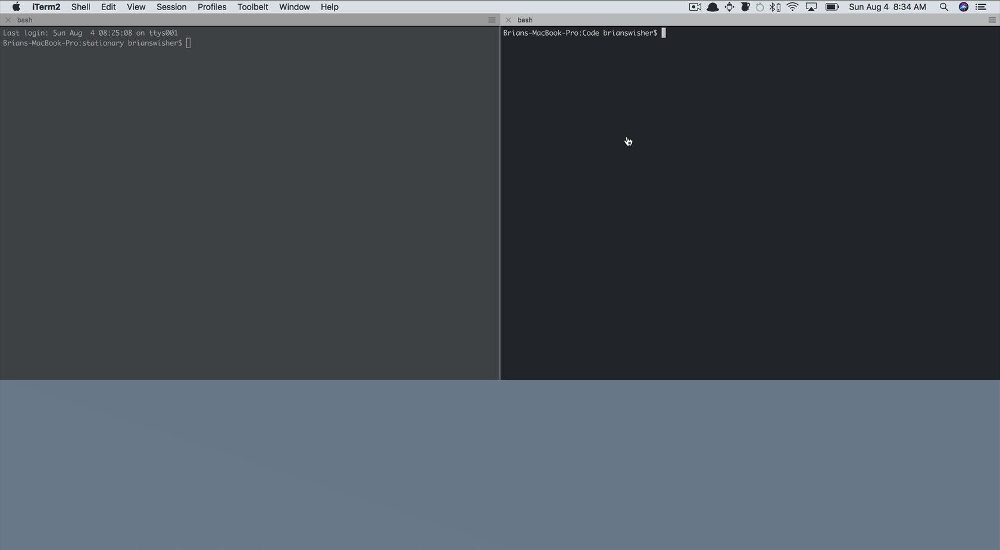
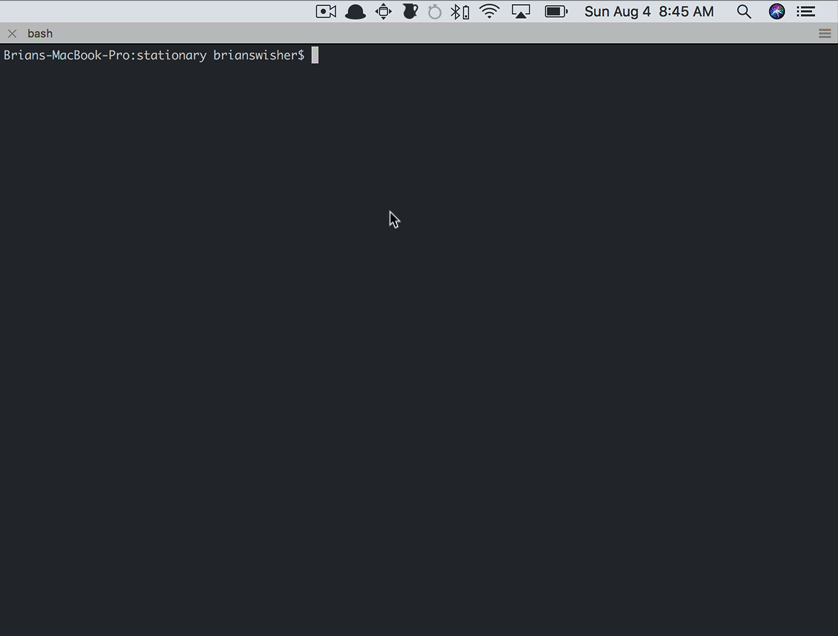
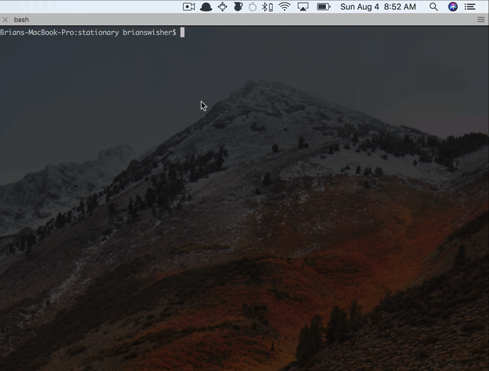

# Stationary
Source files for brianswisher/stationary

## Staged
[here](http://brianswisher.com/stationary)

### Quick Start

```sh
git clone git@github.com:brianswisher/stationary.git

cd stationary

git checkout src

npm i

npm run develop

```



### Test

```sh
npm test
```



### lint

```sh
npm run lint
```


### prettier

```sh
npm run pretty
```


